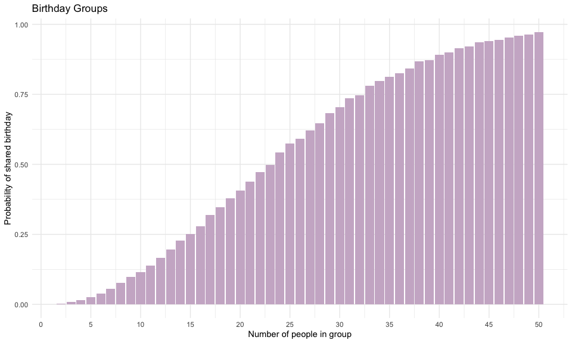
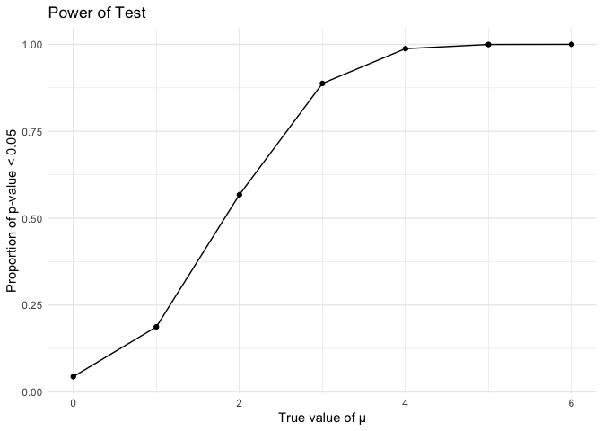
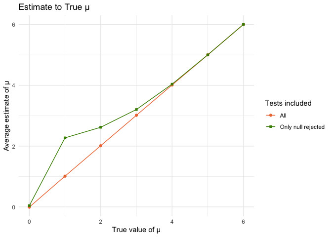
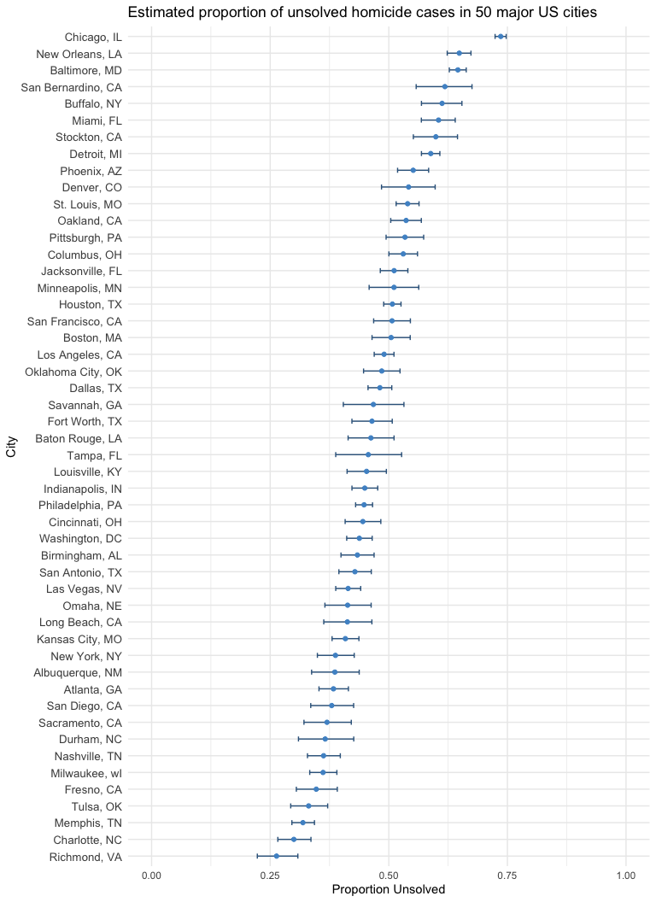

p8105_hw5_jm5916
================
Juhi Mattekatt
2025-11-13

# Problem 1

### Create function

``` r
birthday = function(x) {
  birthdays = sample(1:365, x, replace = TRUE) #select bdays (equal distribution), allow for repeats
  return(any(duplicated(birthdays))) #true if there are any repeated bdays
}

#test function
birthday(5)
```

    ## [1] FALSE

### Simulate groups and plot

``` r
#Simulation
probabilities <- tibble(
  group_size = 2:50,
  probability = map_dbl(2:50, ~mean(replicate(10000, birthday(.))))
)

#Plot
probabilities %>% 
ggplot(aes(x=group_size, y=probability)) + 
  geom_bar(stat = "identity", fill = "thistle3") +
  scale_x_continuous(breaks = seq(0, 50, by = 5)) +
  labs(title = "Birthday Groups",
       x = "Number of people in group",
       y = "Probability of shared birthday") +
  theme_minimal()
```

<!-- -->

The probability of two people sharing a birthday increases as the number
of people increases. It goes over 50% around 23 people, and the
probability is over 90% at 40 people.

# Problem 2

### Create function

``` r
#fix conditions
n = 30
sigma = 5

sim_mean_sd = function(mu) {
  
  sample = rnorm(n, mean = mu, sd = sigma) #normal distribution
  
   results = t.test(sample, mu = 0) %>% #𝛼=0.05 is default
     broom::tidy() %>% 
     select(estimate, p.value) #inlcude only estimate and p-value
   
   return(results)
}
```

### Simulation

``` r
#for just mu = 0
sim_results_0 = 
  map(1:5000, ~ sim_mean_sd(mu = 0)) %>% #run 5000 times
  bind_rows()

#simulation for all mu's
sim_results_list = list()
mu_values = c(0, 1, 2, 3, 4, 5, 6)

for(mu in mu_values) { #using a for loop this time to practice 
  sim_results <- map(1:5000, ~ sim_mean_sd(mu = mu)) %>%
    bind_rows() %>% 
    mutate(mu=mu) #replace mu for every new loop
  
  sim_results_list[[as.character(mu)]] = sim_results #list contains all samples for each mu
}
```

### Power Plot

``` r
#combine results into one df for plots
sim_results_all = bind_rows(sim_results_list, .id = "mu")

#create power plot
power = sim_results_all %>%
  group_by(mu) %>%
  summarise(total_sim = n(),
            reject = sum(p.value < 0.05),
            power = reject/total_sim) %>% #power equation
  ggplot(aes(x = as.numeric(mu), y = power)) +
  geom_line() +
  geom_point() +
  scale_x_continuous(limits = c(0, 6), 
                     breaks = seq(0, 6, by = 1)) +
  labs(title = "Power of Test",
       x = "True value of μ",
       y = "Proportion of p-value < 0.05") +
  theme_minimal()

power
```

<!-- -->

Proportion of p-value \< 0.05, or power, increases as the true value of
μ increases, this suggests that power increases with effect size
assuming that sample size and sd remain constant.

### Estimate Plot

``` r
estimate <- sim_results_all %>%
  group_by(mu) %>%
  summarise(
    av_est = mean(estimate), #average estimate of 𝜇
    av_null_est = mean(estimate[p.value < 0.05]), #average estimate of 𝜇̂ only in samples for which the null was rejected
    reject_count = sum(p.value < 0.05), #check to make sure I have correct numbers
    .groups = "drop") %>%
  ggplot(aes(x = as.numeric(mu))) +
  geom_line(aes(y = av_est, color = "All")) + 
  geom_point(aes(y = av_est, color = "All"), shape = "circle") +
  geom_line(aes(y = av_null_est, color = "Only where null was rejected")) + #overlaying plots
  geom_point(aes(y = av_null_est, color = "Only where null was rejected"), shape = "square") +
  labs(
    title = "Estimate to True μ",
    x = "True value of μ",
    y = "Average estimate of μ",
    color = "Tests included"
  ) +
  scale_color_manual(values = c("All" = "sienna2", "Only where null was rejected" = "chartreuse4")) + 
  theme_minimal()

estimate
```

<!-- -->

The green line representing sample average for tests in which the null
was rejected deviates away from the line representing the sample average
of all the tests at smaller true values of mu and comes closer to the
line at bigger values of mu. This suggests that the sample average of
estimated 𝜇 across tests for which the null is rejected is approx. equal
to the true value of 𝜇 only when the effect size is large.

This is likely because removing samples from our simulation as we do
when only including those in which the null is rejected introduces bias
to our estimate. Thus, the more samples we remove, the larger our bias
and the more our estimate deviates away from the truth. This is
especially apparent in conditions where the effect size is small because
these estimates have smaller power and a greater number of their samples
will be removed. Larger effect sizes don’t have this problem because
their tests tend to have more power and fewer of their samples are
removed, leading to less bias (there is still some bias however as we
are still only including those tests where the estimate was large enough
to have enough power to reject the null hypothesis).

# Problem 3

### Import data from web

``` r
library(readr)
homicides = 
  read_csv("http://raw.githubusercontent.com/washingtonpost/data-homicides/refs/heads/master/homicide-data.csv")
#viewed data in console
```

This dataset from the Washington Post lists homicide data from 50 major
US cities. It has 52179 observations and 12 columns, and includes
information like victim name, date of report, race, age, and city.

### Create new variable city_state

``` r
city_state_hom = homicides %>% 
  mutate(
    city_state = paste(city, state, sep = ", ")
  ) %>% 
  group_by(city_state) %>% 
  summarise(total_hom = n(),
            unsolved = sum(disposition %in% c("Closed without arrest", "Open/No arrest")))

#view in console
```

There are 51 cities listed here. There is an observation where Tulsa was
listed as being in AL, which might explain this “extra” city. I will not
fix this mistake but I will drop this observation for future steps.

### Estimated proportion of unsolved cases in Baltimore, MD

``` r
baltimore_hom = city_state_hom %>% 
  filter(city_state == "Baltimore, MD")

baltimore_hom_test = 
  prop.test(x = pull(baltimore_hom, unsolved), #run prop test
          n = pull(baltimore_hom, total_hom)) %>% 
  broom::tidy() %>% #tidy output
  select(estimate, conf.low, conf.high) #only want estimated proportions and CIs

baltimore_hom_test
```

    ## # A tibble: 1 × 3
    ##   estimate conf.low conf.high
    ##      <dbl>    <dbl>     <dbl>
    ## 1    0.646    0.628     0.663

Estimated proportion of unsolved homicides in Baltimore, MD = 0.65 (95%
CI: 0.63, 0.66)

### Estimated proportion of unsolved cases for all cities

``` r
city_prop <- city_state_hom %>% 
  filter(city_state != "Tulsa, AL") %>% #remove miscode
  mutate(prop_test_results = map2(unsolved, total_hom, ~ prop.test(.x, .y) %>% #use map2 to repeat test.prop
                                    broom::tidy())) %>% #tidy 
  unnest(prop_test_results) %>% #make results accessible 
  select(city_state, estimate, conf.low, conf.high) #only want estimated proportions and CIs for each city

head(city_prop)
```

    ## # A tibble: 6 × 4
    ##   city_state      estimate conf.low conf.high
    ##   <chr>              <dbl>    <dbl>     <dbl>
    ## 1 Albuquerque, NM    0.386    0.337     0.438
    ## 2 Atlanta, GA        0.383    0.353     0.415
    ## 3 Baltimore, MD      0.646    0.628     0.663
    ## 4 Baton Rouge, LA    0.462    0.414     0.511
    ## 5 Birmingham, AL     0.434    0.399     0.469
    ## 6 Boston, MA         0.505    0.465     0.545

#### Plot

``` r
city_prop %>% 
  arrange(estimate) %>% 
  mutate(city_state = fct_inorder(city_state)) %>% 
  ggplot() + 
geom_errorbar(aes(y=city_state, xmin=conf.high, xmax=conf.low), width = 0.3, color = "steelblue4") + 
geom_point(aes(y=city_state, x=estimate), size = 1.5, color = "steelblue3") +
  labs(
    title = "Estimated proportion of unsolved homicide cases in 50 major US cities",
    x = "Proportion Unsolved",
    y = "City") +
  scale_x_continuous(limits = c(0, 1)) +
  theme_minimal() +
  theme(axis.text.y = element_text(size = 10, hjust = 1, lineheight = 1.5))
```

<!-- -->

Chicago, IL, New Orleans, LA, and Baltimore, MD have the highest
estimated proportion of unsolved homicide cases among the cities
included in this dataset. No city has more than 75% of homicides
unsolved. Richmond, VA has the smallest estimated proportion of unsolved
cases at just over 25%. Confidence intervals vary with sample size.
